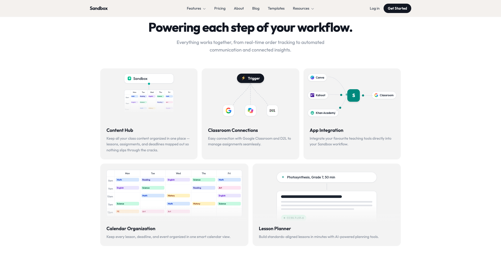
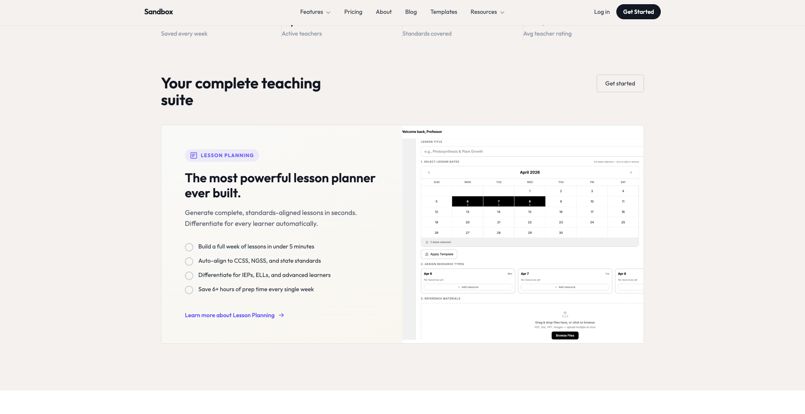
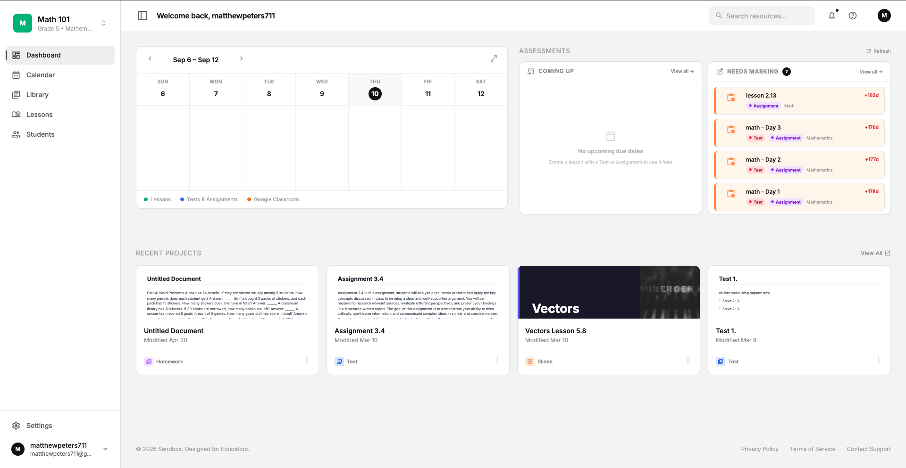
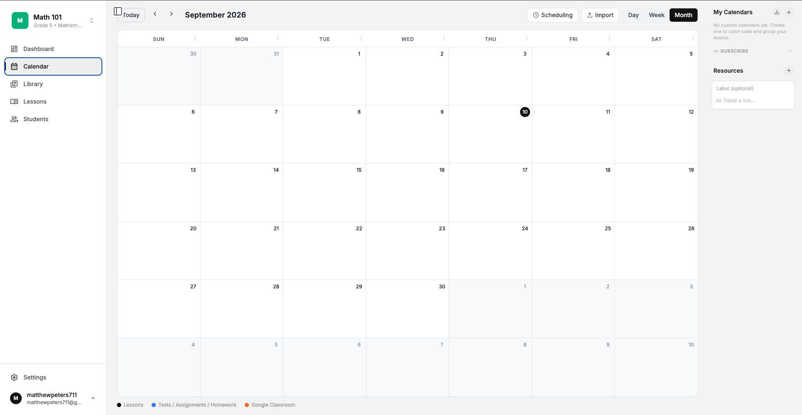
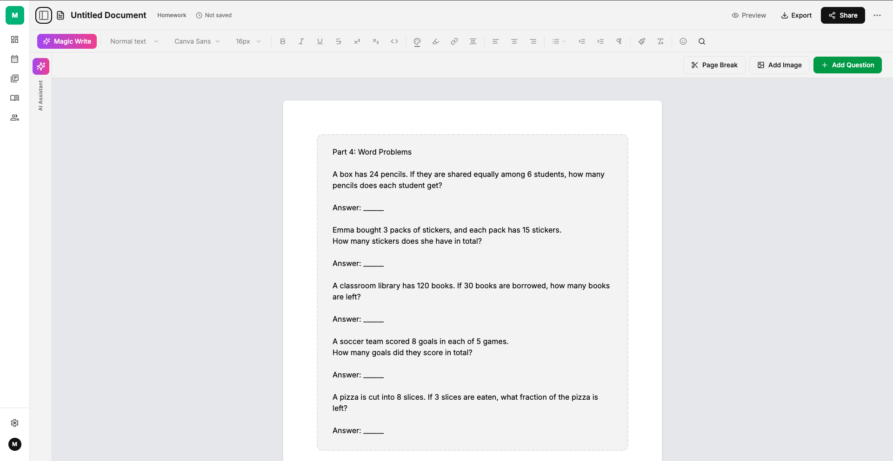

# Sandbox

An AI assisted teaching productivity platform for K through 12 teachers: lesson planning, worksheets and assessments, a shared class calendar, and classroom tool integrations (Google Classroom, Canva, Kahoot, Khan Academy), built as a full stack Next.js application on Firebase.

This repo is a technical write up of how the system is put together. The source application itself is closed, so this focuses on the architecture decisions rather than the code.

## Tech Stack

| Layer | Technology |
|---|---|
| Frontend | Next.js 15 (App Router), React 19, TypeScript, Zustand |
| UI | Tailwind CSS, Radix UI, HeroUI, Framer Motion |
| Backend | Next.js API routes (Node.js) on Firebase App Hosting (Cloud Run) |
| Database | Firebase Firestore (NoSQL document store) |
| Auth | Firebase Authentication (ID tokens verified on the server) |
| AI | Anthropic Claude and OpenAI, called on the server |
| Editor | A block based document model (plus TipTap for rich text in slides) |

## Client/Server Architecture

Sandbox uses a **client and server architecture**, but not a uniform one: which layer handles a request depends on how sensitive the data is.

* For ordinary application data (lessons, worksheets, templates, classes), the **browser talks directly to Firestore** using Firebase's client SDK. This is a deliberate choice, not a shortcut: Firestore's client SDK gives real time listeners, offline caching, and optimistic UI for free, and it takes load off the server entirely. Access control is enforced declaratively by `firestore.rules` rather than by a server layer that would otherwise just be proxying reads and writes.
* For anything more sensitive, the browser is **not** trusted with a database handle at all. Instead it calls a **Next.js API route**, which:
  1. Verifies the caller's identity by validating the Firebase ID token against Google's public signing keys (`jwtVerify` against a remote JWKS, done directly with `jose` rather than the `firebase-admin/auth` helper, which pulls in a CommonJS/ESM dependency conflict on the Node runtime this app deploys to).
  2. Rechecks record ownership in code before touching the database.
  3. Only then uses the Firebase **Admin SDK**, which has elevated privileges the client is never given.

So the "server" in this split is a thin, stateless verification and ownership enforcement layer. Its job is to be the one place a security boundary is enforced in code, not to sit in the middle of every request. This also happens to be a clean fit for Cloud Run: API routes are stateless and scale horizontally, since nothing about the security model depends on which instance handles a given request.

## Database: Firestore, Split for Security

The primary database is **Firestore**, a NoSQL document store. A document oriented database fits the content model well: a lesson or worksheet is naturally a single JSON document (a title plus an ordered array of content "blocks"), so there's no join or relational schema needed to read or write one. The whole thing loads and saves as one object.

The more interesting decision is that the app actually runs **two separate Firestore databases in the same project**, not one:

* A default database for regular application content, reachable directly from the browser and governed by `firestore.rules`.
* A second, access controlled database for the platform's most sensitive data category, which has **no client side access path at all**: no client code anywhere even initializes a handle to it. It's reachable only from server side API routes via the Admin SDK, with ownership rechecked in application code on every read, write, and delete, and every operation written to an append only audit log from the server side (so the audit trail can't be bypassed or forged by a client).

The point of the split is defense in depth for the platform's highest sensitivity data: even if a rule were ever misconfigured on the default database, there's no code path, client or otherwise, that lets a browser reach the second database directly. Separation is enforced structurally (which SDK is used, and from where), not just by a permissions check that could be edited or missed.

An earlier design considered solving this with **physical isolation**: a dedicated on premises server per school or district. But that conflates two different problems: data confidentiality (a technical concern, solvable in software) and data location (an operational one, expensive and unnecessary here). The current design gets the same confidentiality guarantee from database separation and server mediated access, without provisioning or maintaining any physical infrastructure.

**Earlier iteration:** an earlier version of the backend used **PostgreSQL** (via SQLAlchemy and Alembic) behind a **FastAPI** service, with **Celery** for background jobs: a fairly conventional relational backend setup. That's no longer part of the live data path; the platform moved to the Firestore and Next.js API route model above, which better fit a content model shaped like documents and a serverless deployment target.

## Caching and Rate Limiting

Sandbox runs on Firebase App Hosting, which deploys to **Cloud Run**: instances scale horizontally and any instance can start cold at any time. That constraint directly shaped the caching strategy.

A naive **in memory rate limiter** doesn't work here, because a client's requests can land on a different instance each time, each with its own empty counter. The limit would be trivially bypassable just by chance. So the AI API routes (the most expensive, most abuse prone endpoints) use a **fixed window counter stored in Firestore** as the single source of truth, incremented inside a **transaction** so concurrent requests, even from different instances, can't race past the cap.

Firestore is not built to be hit on every single request the way a proper cache like Redis is, though, so there's a second layer: each instance keeps a small **in memory fast path cache** of keys it has already seen exhaust their window. That cache never grants more than Firestore has authorized. It only ever short circuits an obvious "already over limit" case, but it means a client hammering the endpoint after being cut off doesn't cost a Firestore round trip on every retry. It's deliberately fail open: if Firestore is unreachable, requests are allowed rather than blocked, since rate limiting here is a protective measure for cost control, not the authentication boundary.

This is essentially a **distributed cache with a local fast path**, chosen over a dedicated cache like Redis specifically because it needed to be consistent across ephemeral, horizontally scaled instances without operating a separate stateful service.

## Document Editor: Files, New Documents, and Saving in Real Time

Each worksheet, homework assignment, or lesson document is stored as a **single Firestore document**: a title, a document type, and a `content.blocks` array, each block a typed object (`text`, `heading`, `multiple-choice`, `fill-blank`, `essay`, `image`, `table`, `divider`, …). There's no separate file per block or per page; the whole document is one JSON object, which keeps loading, saving, and duplicating a document a single read and write instead of several separate steps.

**Editor state** lives in a Zustand store, independent of the Firestore layer. The store holds the in progress blocks, an `isDirty` flag, and the current `documentId`. A thin service layer (`documentService`) sits between the store and Firestore so the store never talks to the database directly.

**Creating a new document** doesn't allocate a Firestore ID up front. The editor opens with a virtual `documentId` of `"new"`, and the user can start typing immediately. The first time it saves, the app creates the Firestore document, gets back a real ID, and then calls `window.history.replaceState()` to swap the URL from `.../doc-editor/new` to `.../doc-editor/<id>`, without a page reload or navigation. The document seamlessly "becomes" a permanent, shareable, bookmarkable resource mid edit, rather than requiring a separate "create" step before editing can start.

**Saving in real time** is handled two ways at once:
* An **automatic save interval** fires every 5 seconds, but only writes if the `isDirty` flag is set, so an idle document with no changes never generates writes.
* **Manual save** via Cmd/Ctrl+S, which is skipped if a save is already in flight (`isSaving`), so rapid saves can't race each other.

On top of that, each save also writes a lightweight version snapshot to `localStorage` (keyed per document), giving cheap local version history without adding a full version history collection to the database for something that's mostly used as an "undo to five minutes ago" safety net.

## AI: Curriculum Grounding and Content Safety

The AI features (lesson and worksheet generation, question generation, editing assistance) are not just a raw call to a language model. Two separate engineering layers sit around every generation call: one that grounds the output in the actual curriculum a teacher is teaching, and one that checks what goes in and what comes out.

**Curriculum grounding.** The platform keeps a typed registry of official curriculum documents (currently Ontario, Canada, grades four through twelve), organized by country, province, grade, and course code. Each entry holds the real strands, overall expectations, and specific expectations published by the ministry, not a general notion of what a given grade level should look like. When a teacher asks the AI to generate content for a subject and grade, a resolver looks up the matching course using a set of subject matching rules, checked from most specific to least (history and geography are kept separate from a general social studies match, for example, since at the middle grades they are genuinely different courses). For math, where the same grade can have several pathways (academic, university, college, workplace), a preference order picks the most likely one. If the resolver cannot confidently identify a single course, for instance an unrecognized subject or multiple courses tied for a grade, it returns no grounding at all rather than guessing. When it does find a match, it builds a bounded block of text listing the grade level expectations for that course and puts it in the system prompt, so the model is generating content that has to line up with expectations a curriculum body actually published, not just the model's own sense of what is age appropriate.

**Input safety.** Before any teacher supplied text reaches a model, it goes through a screening pass: a length cap, and a check for patterns associated with prompt injection or jailbreak attempts (trying to get the model to ignore its instructions, adopt a different persona, or reveal its system prompt). Anything flagged is rejected with a generic message rather than being sent through. Text that passes is still wrapped in explicit delimiters marking it as data to be worked on, not instructions to follow, so the model has a structural reason to treat a teacher's pasted text as content rather than as commands.

**Output safety.** Generated content passes through a second, independent check before it reaches a teacher: a small, fast model acts purely as a classifier, reading the output and returning a plain appropriate or not appropriate verdict for a K through 12 audience. It is told to flag sexual content, graphic violence, self harm encouragement, hate directed at protected groups, and instructions for weapons, drugs, or other illegal activity, while treating ordinary educational discussion of sensitive topics (history, biology, health, current events) as appropriate. This check deliberately fails open: if the classifier errors or cannot be reached, the content is allowed through rather than blocked, since the primary generation already ran against a hardened prompt and the goal here is a second opinion, not the only line of defense. On top of the content check, generated output is also structurally validated: block and question types are checked against an allowed list, style properties are filtered to a known set of keys, and any image URL has to parse as https before it is accepted. Malformed output is rejected outright rather than partially rendered.

**Student data in AI calls.** Personalization features that use a student's own record are treated differently again, since sending a student's identity to a third party AI vendor is a different order of risk than a generic content check. There are two layers here. First, a single allowlist function is the only code path allowed to turn a full student record into something an AI call can see: it picks a small set of fields (grade level, learning style, a plain language performance summary with no individual test names or dates) and explicitly redacts the student's name out of any free text, rather than trying to blacklist everything sensitive. Second, immediately before the request actually goes out to the AI vendor, a separate check scans the fully assembled prompt one more time for that specific student's identifiers, as a backstop for anything the first layer's redaction might have missed. Unlike the content classifier, this check fails closed: if it cannot confirm the prompt is clean, the call is blocked rather than allowed through, on the reasoning that a false positive costs a teacher a retry, while a false negative sends a student's name somewhere it should not go.

All of this sits underneath a broader compliance goal, since the platform handles student data covered by FERPA and COPPA. The specifics of that compliance work (data handling agreements, retention rules, and so on) are outside the scope of a system design write up, but the engineering pattern above, grounding output in real curriculum data and running independent checks on both sides of every AI call, is the technical backbone that makes the compliance posture possible.

## Product Screenshots

| | |
|---|---|
|  |  |
| Lesson planner: standards aligned lesson generation | Dashboard: upcoming lessons, assessments to mark, recent documents |
|  |  |
| Class calendar: lessons, tests and assignments, and synced Google Classroom events | Document editor: a block based worksheet and homework editor with AI assist |
